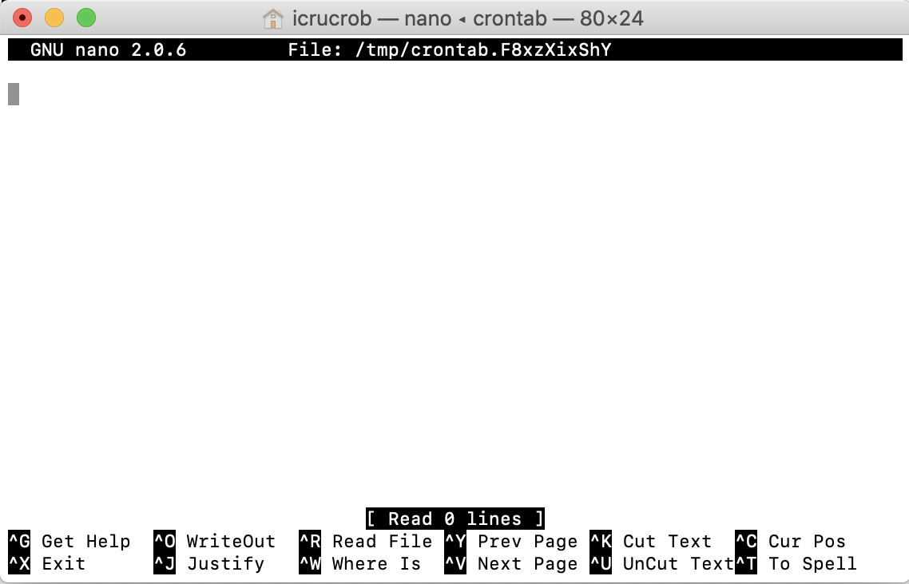

#Example *Cron* file

##Instructions for use on a linux/unix system

The time based scheduler `cron` is the basis for a simple system of automation that requires no additional software installation. Cron is controlled through a system file called the `crontab` which is essentially a text file that contains commands that specify the time at which a process should regularly occur, plus the nature of that process.

In this example, we provide instructions for how to access and edit the crontab and to schedule tasks including the [ODK archiver](../01_ODK_Archiver) and [ODK Analyser](../02_ODK_Analyser) scripts.

Commands to type in terminal are shown as code snippets
Throughout the examples, we will assume that you are logged in as user `hilary` and that your working directories are in `/Users/hilary/Documents/`

### First Test 
In this stage, we will access the crontab and add a simple scheduled task.
The task with use the system's `touch` command to update the last-accessed date of a file.

* Create a text file called `touchme.txt` in the directory `/Users/hilary/Documents/`

* Start a terminal session

* Open the `crontab` using the `nano` text editor with the following command

```
export VISUAL=nano; crontab -e
```
* If this is the first time you have used cron, you will see a message similar to this.

> crontab: no crontab for icrucrob - using an empty one

* You should now see the `nano` interface




* `nano` is a quite basic text editor with a couple of obscure keystrokes that you need to know about. When you've finished editing the file, you will press `CTRL + X` to exit, at which point you'll be asked at the bottom of the screen if you want to `Save modified buffer (ANSWERING "No" WILL DESTROY CHANGES) ? `. This means "Do you want to save your changes?" so you'll usually press `y` followed by `enter` to save your new `crontab`.  

* It helps to have some notes in any piece of computer code. As with most computer languages, any line of the `crontab` which starts with a hash is ignored by the system, meaning that you can use it for notes. 


* If you are using a mac with Catalina or above, you may need to provide `cron` full access to your system. 

>If the latest versions of Mac OS faces cron permissions issues, then you should have to grant full disk access. Let’s go by the following steps to allow the full disk access to cron.  
>Go to System Preferences in Apple Menu and select the “Security & Privacy” option.  
>In the “Privacy” tab, select the “Full Disk Access” option from the side menu option.  
Click on the lock icon in the corner and authenticate with the system password to modify full disk access settings in your Mac.    
>Now pull down the “Go” menu from the Finder in Mac OS and choose “Go to Folder.”  
>Now enter the path: /usr/sbin/cron and select Go.  
>Now you have to drag and drop the “cron” in the list of apps and processes with full disk access permission. Cron should now appear in the list.  
>Get out of system preferences window and open Finder sbin window once you finished.  
>There are security measures introduced with the release of new Mac OS, and causes issues like operation not permitted.   
>For quantifying this issue, you may require a Terminal application to Full Disk Access options.   
>If you rely on smbd for networking purposes, then it should be added to Full Disk Access options.  

* Start by adding this text to the top of your new crontab. 

```
# * * * * *  command to execute
# │ │ │ │ │
# │ │ │ │ └─── day of week (0 - 6) (0 to 6 are Sunday to Saturday, or use names; 7 is Sunday, the same as 0)
# │ │ │ └──────── month (1 - 12)
# │ │ └───────────── day of month (1 - 31)
# │ └────────────────── hour (0 - 23)
# └─────────────────────── min (0 - 59)


########################################################################################
# touch the file /Users/hilary/touchme.txt every minute
########################################################################################
* * * * * touch /Users/hilary/Documents/touchme.txt  >> /Users/hilary/Documents/cron.log 2>&1
```

* The first seven lines are all notes and provide a some reminders about how to use `cron`. 

* After this, we see our first useful piece of scheduling
Note how hashed lines add some explanation of what `cron` will do, for instance here to perform the `touch` command on the `/Users/chrissyhroberts/touchme.txt` file.

* As you can see from the handy header we just added, the time scheduling of `cron` is controlled by the characters at the beginning of the line, with each of the characters relating to (in order) minutes, hours, day-of-month, month, day-of-week
>
`* * * * *` is the default schedule to perfom a task every minute of every day.  
`1 * * * *` would run the schedule on the first minute od each hour of the day.   
`1 1 * * *` = 01:01 each day.  
`1 1 * * 1` = 01:01 on mondays.  
`*/10 * * * *` = every 10 minutes.  
`32 5 1 * *` = 05:32 on the first day of the month

* In the touch command, you can see that the time schedule is set for `* * * * *` default of every minute. Then the `touch /Users/hilary/Documents/touchme.txt ` command tells cron what to do. Finally this part `>> /Users/hilary/Documents/cron.log 2>&1` tells cron to send any errors or messages to an easy to find log file called `cron.log`

* There's a lot more you can do with cron, and you can learn more from the internet, but this is the basis of automation and for a daily schedule you would only really need to control the first two characters in the `cron` command. 

* Now that you understand the basic use of `cron` it is time to exit `CTRL + X` and save by pressing `y` followed by `ENTER`. This installs the new crontab which will start running automatically. 

* To test that everything is working as expected, paste the following in to the terminal.

```
ls -l /Users/hilary/Documents/touchme.txt && sleep 61 && ls -l /Users/hilary/Documents/touchme.txt
  
```

This will show you the time the touchme.txt file was last accessed, then wait 61 seconds and show you the information again. If everything is working, then you should see that `cron` has touched the file and the time has updated by one (or sometimes two) minute(s). 

>
-rw-r--r--  1 hilary  staff  8 17 Jun **12:28** /Users/hilary/Documents/touchme.txt  
-rw-r--r--  1 hilary  staff  8 17 Jun **12:29** /Users/hilary/Documents/touchme.txt

* Take another look at the last command you used. Those `&&` signs allow you to run a series of commands in a unix terminal and these will be useful in our cron commands when we want to run first the ODK Archiver and then the ODK Analyser. 

### Crontab for running ODK Archiver and ODK Analyser

The next stage assumes that you have followed the steps in the previous tutorials for setting up the [ODK Archiver](../01_ODK_Archiver/README.md) and the [ODK Analyser](../02_ODK_Analyser/README.md). If not, now is the time to go back and do so. You can't progress further without having all the required folders and software in place. 

* Open the crontab again with
```
export VISUAL=nano; crontab -e
```

* Now we'll add a command that can run both the archiver and analyser systems, using those `&&` commands to run them back to back. This is preferable to scheduling the archiver and analyser separately as you can't predict how long the archiving step would take and it would be bad to perform analysis on incompletely pulled data. With the `&&` system, the next process starts only when the previous one has finished. `cron` commands should be run on a single line.


* **Add this text to the crontab**

```
########################################################################################
# Run the Archiver and Analysis for Project 01 at 01:00 each day
########################################################################################

0 1 * * * cd /Users/hilary/Documents/Archiver_project_01  && bash ODK_Archiver.sh > /Users/hilary/Documents/Archiver_project_01/Archiver_project_01.cron.log 2>&1 && cd /Users/hilary/Documents/Analyser_project_01/ &&  /usr/bin/Rscript /Users/hilary/Documents/Analyser_project_01/000_run_EDK0006_analysis.R > /Users/hilary/Documents/Analyser_project_01/Analyser_project_01.cron.log 2>&1 

```

Close `CTRL + X` and save `y` `ENTER` to install the new crontab.

* **To break down this command for clarity**

`0 1 * * *` schedules the process for 01:00 each day. 

`cd /Users/hilary/Documents/Archiver_project_01` changes the working directory to the folder of the ODK archiver for project 01.  

`&&` waits until the working directory has been changed

`bash ODK_Archiver.sh` runs the ODK.Archiver.sh script in the bash command language interpreter. Note that to run a script you have to provide the name of the interpreter or app under which it is to be run.

`>` sends the terminal output to a new log file

`/Users/hilary/Documents/Archiver_project_01/Archiver_project_01.cron.log` is the path and name of the log file for the archiving process

`&&` waits until the Archiving is complete and then 

`cd /Users/hilary/Documents/Analyser_project_01/` changes the working directory to the folder of the Analyser for project 01.

`&&` waits until the working directory has been changed

`/usr/bin/Rscript /Users/hilary/Documents/Analyser_project_01/ODK_analyser.R` runs the R script that performs the analysis. Note that the full path to the Rscript function has to be provided, in this case `/usr/bin/Rscript`. If you don't know this, then typing `which Rscript` in to a terminal should tell you the correct path for your system.

`> /Users/hilary/Documents/Analyser_project_01/Analyser_project_01.cron.log 2>&1` sends the terminal output to a log in the Analyser folder. The `2>&1` part ensures that any errors are also logged.

 


