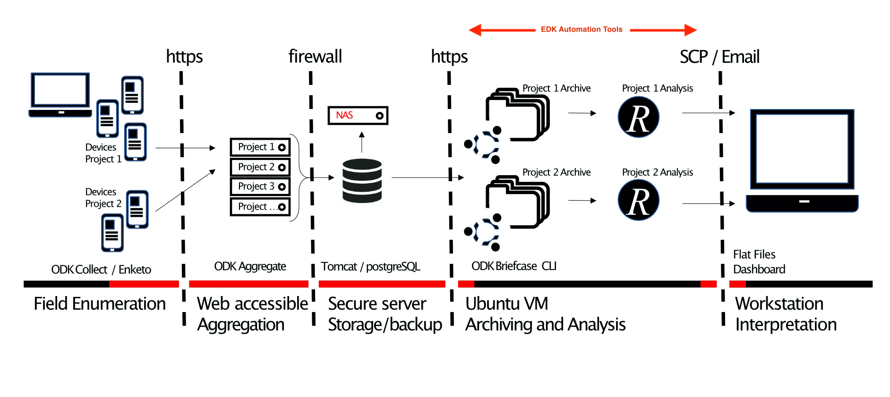

# EDK Automation Tools

##Background

These tools provide systems to automatically manage, analyse and generate reports from an ODK server archive of data.

To use these tools, it is anticipated that the end user already has a working installation of an ODK server (*ODK Central*, *ODK Aggregate*). Running this system on a network or cloud based virtual machine provides protection against workstation failure, but the system can be installed on any modern linux platform or on the **Windows Subsystem for Linux**. We have successfully installed and operated the system on an Ubuntu 18.04.4 VM, a 24" 2014 iMac running OS X 10.14 and a Raspberry Pi 3 B+ running a vanilla installation of Raspbian. 

The automation processes rely on the native unix *cron* command, ODK Briefcase CLI, R, Rstudio, R Markdown and FlexDashboards. A typical system design is provided in Figure 1 and these tools bridge the gap between the ODK SQL database and analysis in R or other downstream data handling, statistical analysis, reporting and analysis tools.

**Figure 1 : Typical System Design for automation of ODK data analysis**.  
*Devices in the field are used to carry out data collection (enumeration) activities. Encrypted records are submitted to one of many parallel  web accessible ODK Aggregate servers. All servers lead to a single PostgreSQL database and backup system. All backups contain only encrypted form data. An Ubuntu virtual machine is scheduled to perform archiving (data pull, decrypt and export activities) and analysis (data tidying, analysis and report generation) using R and R markdown.  Areas highlighted in red show where data are stored or transferred in encrypted formats and are non-human readable.*

###Cron automation 

We organised the EDK system infrastructure to allow for the simultaneous operation of a number of parallel activities (projects). Each project was provisioned with its own dedicated ODK Aggregate server front end with unique Uniform Resource Locator (URL) and configurable user privileges. These project specific front-ends allowed for aggregation of data from EDC devices in the field, and for end-user level  management of case report forms (CRFs) and individual project data entities in isolation from other projects, their CRFs and data. Behind the front-end, data from the many parallel projects were stored in a unified format on a single Tomcat or postgreSQL database which was placed behind an institutional firewall and which was regularly backed up for data protection and recovery from failure. For each project, a data analysis pipeline was created on a virtual machine (VM) which was able to call data from the postgreSQL database and to perform automated analysis, monitoring and reporting functions. Between project analytics were also possible. The addition of new projects required three steps including (1) the creation of a new ODK Aggregate front end, (2) design and deployment of project specific CRFs and (3) development of an analytics pipeline to match the needs of the project. 

###Software Developments in the ODK ecosystem

ODK Briefcase is a desktop application which acts contains an application programming interface (API) that bridges the gap between study data on a server and the downstream analysis pipeline. It can both download individual data submissions (pull actions) from the ODK Aggregate server database and also parse, aggregate and export data to various formats, systems and backups. In the simplest terms, ODK Briefcase converts the many individual data files collected from the field into a single data set that is ready for analysis. 

During the early development of EDK, we reached bottlenecks in the form of the time taken to perform pull and export actions. As the number of data submissions increased, so the time taken to process the data came to exceed the 24 hour analysis and reporting cycle. In order to make it possible to handle millions of CRF submissions to the EDK system without impacting significantly on time taken for pull and export operations, we introduced two performance related features to Briefcase, including "smart append" and "resume from last" controls.

The "smart append" feature speeds up exports of large datasets by remembering the full date and time of the last submission included in the most recent export for each form. By contrast to the historical approach where all existing records were exported, the smart append feature exports only only submissions which are new since the last export operation completed, appending these to the exported data from previous sessions. 

The "resume from last" feature has an analogous function for the pull operations and speeds up downloads of submissions from Aggregate by keeping track of information representing the last downloaded block of submissions and thereby only requesting new submissions in subsequent pulls. Previously, all submissions were always requested and Briefcase identified and discarded duplicates on download, leading to a potentially very large number of redundant network requests and database checks during each pull activity. The historical approach became prohibitively slow when the submission count reached the hundreds of thousands or more.

Both new features required storing new metadata in Briefcase and augmenting the graphical and command line interfaces. This work highlighted limitations of the Aggregate submission download API and has fed into the design of a replacement API that will be implemented in future versions. .

The use of metadata files to store the cursor position was found to be preferable over storing this information in a system level preferences store as this change facilitated retention of the last pull/export positions in backups, thereby eliminating the need to start pulls and exports from the first submission after any system failure and/or recovery from backup. 

###Strengthening security of Enketo webforms

Enketo Smart Paper is a suite of Javascript tools which is part of the OpenRosa/XForms ecosystem and which among other uses can provide a web interface to ODK Aggregate servers. A longstanding feature of ODK Collect is its ability to asymmetrically encrypt CRFs at the level of the individual form using a powerful cryptographic process. This use of cryptography has particular value for research studies that collect sensitive data, such as those for which the EDK system was designed, not least because in the postgreSQL database and in all backups the study data remain encrypted. Historically the Enketo system did provide functionality for secure end-to-end data transfers, but had no capability to encrypt CRF data at the form level. 

The implementation of a Java-based encryption methodology in Javascript was a challenging task because internet browsers have no native equivalent implementations of the algorithms used. We analyzed and documented the encryption methods used in ODK Collect, before reverse engineering them for use in Enketo. After testing with ODK Briefcase, we openly published a fully ODK/ENKETO cross-compatible implementation of ODK’s encryption algorithm that works across platforms and on all modern browsers. This implementation can handle and co-encrypt binary attachments, such as photos, movies and data from other sources. We went on to author a sub-specification of the encryption algorithms, which have now been published as part of the open ODK XForms specification (https://opendatakit.github.io/xforms-spec/encryption). To facilitate the creation of an alternative ODK-compatible encryption/decryption library or application in the future, we separated our encryption implementation into its own module within the Enketo Express code-base (https://enketo.org/).

Figure 2 : Case Report Forms (CRFs) and their use in VSV-ZEBOV-GP vaccination within a typical ring.  

(5) Automation of data management and analysis

To enable an automated system to manage the pull, decrypt & export actions of Briefcase and to then perform data analysis and report generation steps, we set up a simple Ubuntu Virtual Machine and scheduled automated operations using the cron utility. Cron is a powerful time-based job scheduler that is part of all linux- and unix-like systems. It allows computer code to be run on a regular basis and at predefined times. Cron requires very little computing experience and should be accessible to most users with support from an information technology team. On Windows systems it is possible to use the Windows Task Scheduler to achieve the same goal of automated pull, export and decrypt actions, or to use the recently released Windows Subsystem for Linux. 

We conceptualised and implemented the data management tasks as two separate domains of work which included both archiving and analysis activities. Archiving consisted of the management of the raw form submissions, along with the maintenance of a set of up-to-date and human readable table of raw data files in comma separated value (CSV) format. The outputs of the archiving phase thereby represented the aggregated data from each CRF which formed the basis for all work in the Analysis phase. All activities in the archiving phase were automatically managed by ODK Briefcase. We used cron to run scripts that were able to control ODK Briefcase via the CLI and to perform regular pull, export & decrypt actions. In order to protect the integrity of the data archive from human errors, we treated the CSV files in the archive as volatile entities that were subject to corruption if accessed by software other than ODK Briefcase. In order to ensure the integrity of the files, we isolated the archive from the analysis pipeline and used only copies of the CSV data files in downstream analysis. 

The completion of a cron-scheduled archive process (pull, export, decrypt) triggered a series of R scripts using a linux `pipe` and leading to R’s native `Rscript` CLI command.  On initiation of the R analysis, the first step was to make a working copy of the most up to date CSV files (from the archiving phase) in a system folder outside the ODK Briefcase managed archive folder.  

The analysis of data included the use of both R and R markdown scripts, which eventually generated a large number of reports, charts, tables, line lists and other outcomes that had been conceptualised by the field and vaccination teams. We favoured the use of analysis tools that were both simple to use and openly available. We used primarily ggplot2,  plotly/ggplotly, leaflet and flexdashboard to allow us to create interactive data visualisations that could be easily modified by future users with minimal need for coding. Because of the operational need to provide different teams with daily line-lists, a number of reports were automatically formatted as excel spreadsheets because Excel remains the default tool for many teams working with lists or tables.

